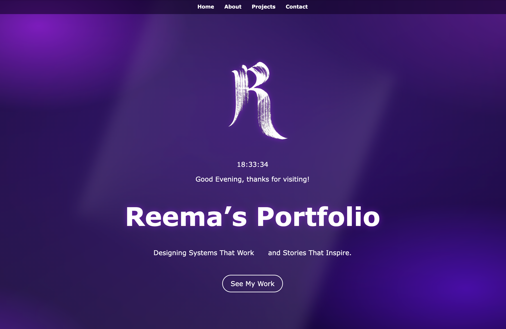
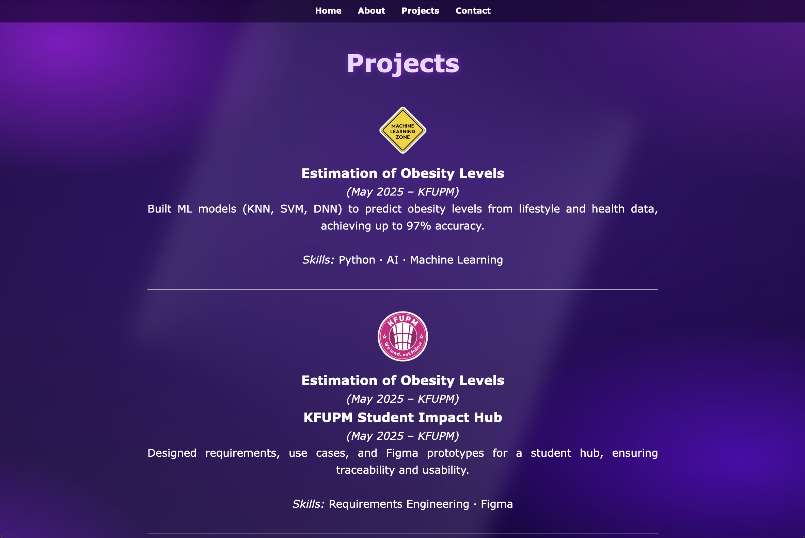
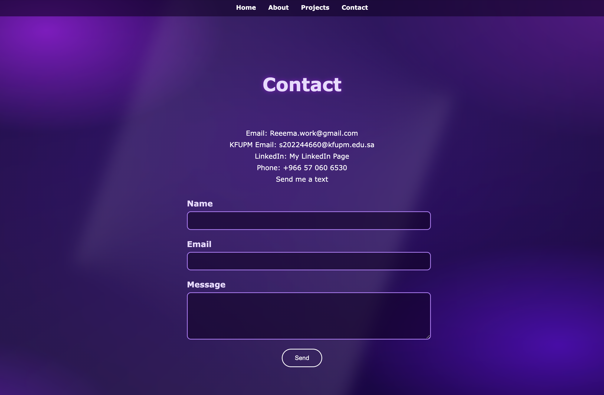

# Reema Al-Qahtani — Portfolio Website

## Overview

This project is a personal portfolio website for Reema Al-Qahtani, a Software Engineering student at KFUPM.  
It serves as a digital space to showcase projects, and contact information, while also highlighting creativity through interactive features like a live clock, dynamic greeting, and animated backgrounds.  
The purpose of the site is to provide a professional yet engaging introduction to potential collaborators, recruiters, and peers by blending functionality with design aesthetics.

---
## Features

- **Animated Background** : Layered radial and conic gradients create glowing, silky motion for a modern aesthetic.  
- **Fixed Glassy Navbar** : A translucent navigation bar with smooth scrolling between sections.  
- **Hero Section with Logo** : Includes a glowing personal logo, dynamic greeting, and a real-time digital clock.  
- **Interactive Contact Form** : Client-side validation with instant thank-you feedback, no backend required.  
- **Responsive Design** : Mobile-friendly layout with adaptive typography and spacing.  
- **Project Showcase** : Organized list of academic and personal projects with skills highlighted.  
- **Accessibility Friendly** : High-contrast text, visible focus states, and keyboard-friendly navigation.  

---
## Tech Stack

- **Frontend:** HTML, CSS, JavaScript  
- **Backend:** None (static site; no server-side framework used)  
- **Database:** None (no persistent storage; form is client-side only)  
- **Other Tools/Services:** GitHub (version control & hosting)

---
## Project Structure
```
SWE363-Assignment1/
│── assets/                                 # Static assets (images, icons, etc.)
│ └── images/                               # Logo and other image files
|   └── Rـlogo.png
│── css/                                    # Stylesheets
│ └── styles.css
│── js/                                     # JavaScript files
│ └── script.js
│── docs/                                   # Documentation
│ ├── ai-usage-report.md                    # Report on how AI was used
│ └── technical-documentation.md            # Technical explanation of the project
│── index.html                              # Main HTML file (entry point)
│── README.md                               # Project README
│── .gitignore                              # Git ignore rules
│── .idea/                                  # IDE project settings (WebStorm auto-generated)


```
---
## Setup and Installation

This is a static website and does not require any build tools or server-side processing.

### Prerequisites

You need a web browser (Chrome, Firefox, Edge, etc.) to view the site.

### Running Locally

1.  **Clone or Download:** Get the project files onto your local machine.
2.  **Open the File:** Simply open the `index.html` file in your preferred web browser.

    *The dynamic features (clock and form status) will work immediately without needing a web server.*

### Deployment

To make the portfolio live on the internet, you can deploy the entire directory to any static site hosting service, such as GitHub Pages, Netlify, or Vercel.

---
## Usage

This project is a static website and does not require any specialized server, build tools, or command-line processes to run.

---

### Step 1: How to Run/Test It

To view the portfolio and test its features:

1.  **Locate the Files:** Ensure you have the full project structure (including the `index.html`, `css/styles.css`, and `js/script.js` files) on your local machine.
2.  **Open in Browser:** Double-click the **`index.html`** file.
    * This will automatically open the portfolio in your default web browser.
    * The browser will interpret the HTML structure, apply the CSS styling, and execute the JavaScript for the clock and greeting.
3.  **Test Functionality:**
    * Verify the **clock and greeting** in the Hero section update correctly.
    * Click the **navigation links** (e.g., `#projects`) to ensure smooth scrolling.
    * Test the **Contact Form** by filling it out and clicking **"Send"** to see the personalized confirmation message.


### Step 2: Example Commands

Since this is a client-side project, there are no typical command-line commands for running or testing. However, here is the command used to easily open the site directly from the terminal (for users familiar with the command line):

| Context | Command | Description |
| :--- | :--- | :--- |
| **Terminal (Mac/Linux)** | `open index.html` | Opens the main page in the default web browser. |
| **Terminal (Windows)** | `start index.html` | Opens the main page in the default web browser. |
| **Viewing Source** | Right-click the page $\to$ **Inspect** | Opens the browser Developer Tools to examine HTML structure, CSS styles, and JavaScript console output (for debugging). |

---
## Example Output



---
## Roadmap / Future Improvements

### Phase 1: Polishing and UX (Next Steps)

* **Project Showcase Upgrade:** Change the project list items into clickable cards or buttons. When clicked, these should open a **modal window (pop-up)** that gives a full, detailed write-up for that specific project (e.g., the ML Obesity Estimation).
    * *Goal:* Provide links to the **GitHub code repository** and, if available, a live demo for each project.
* **Active Navigation Highlight:** Use JavaScript to make the link in the top navigation bar turn a bright color when the user is currently looking at that section of the page (e.g., the "Projects" link glows when the user is scrolling through the Projects section).
* **Form Validation:** Enhance the contact form by adding front-end validation (in JavaScript) to ensure the user provides a valid email format before they click "Send."

### Phase 2: Technical Depth & Professionalism
* **Skills/Technologies Section:** Consider adding a dedicated section (or integrating into the **About Me** section) that uses icons or small badges to visually list all the technologies used across the projects (Python, Java, Flask, Figma, etc.).

---
## AI Usage (More on ai-usage-report.md)
AI tools, specifically ChatGPT and Gemini, were used as advanced learning aids and collaborators throughout the development of this portfolio website.

These tools were crucial for several tasks, including generating the initial complex neon CSS background and helping to debug subtle JavaScript and CSS errors in the code. Additionally, AI helped refine the writing and summarization of project descriptions and personal statements, and provided guidance on organizing technical documentation like the README structure.

---
## Documentation
Additional docs can be found in the [`/docs`](./docs) folder:
- [Technical Documentation](./docs/technical-documentation.md)
- [AI Usage Report](./docs/ai-usage-report.md)

---
## Contributing
Contributions are welcome!  
1. Fork the repo  
2. Create a new branch (`git checkout -b feature-name`)  
3. Commit changes (`git commit -m 'Added new feature'`)  
4. Push branch (`git push origin feature-name`)  
5. Open a Pull Request  

---
## License
This project is not licensed yet.


---
## Author

**Reema Al-Qahtani**
* Software Engineering Student at KFUPM
* **Contact Email:** [Reeema.work@gmail.com](mailto:Reeema.work@gmail.com) or [s202244660@kfupm.edu.sa](mailto:s202244660@kfupm.edu.sa)
* **LinkedIn:** [My LinkedIn Page](https://www.linkedin.com/in/reema-ibrahim-53ba5236a/)
